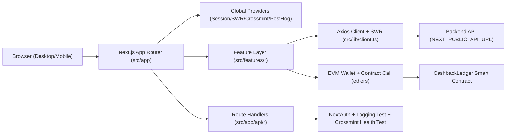
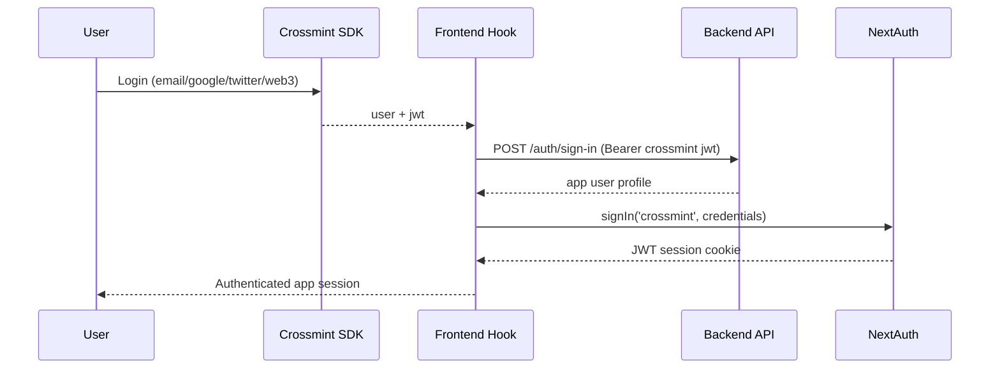

# GoGoCash Web Frontend

Production Next.js frontend for GoGoCash cashback and wallet flows.

This README is an architecture-first onboarding guide so engineers can understand the system quickly and make safe changes with less trial-and-error.

## 1) System Overview

GoGoCash is a Next.js App Router application with:
- Route handlers for auth/debug APIs.
- A dual UI strategy (desktop and mobile components rendered per breakpoint).
- Crossmint + NextAuth authentication.
- SWR + Axios data fetching to backend APIs.
- On-chain withdrawal execution through EVM smart contracts.
- PostHog product analytics and OpenTelemetry log forwarding.



## 2) Tech Stack and Runtime

- Framework: `next@~15.1.4` (App Router).
- Language: TypeScript (`strict: true`).
- UI: React 18, Tailwind CSS, Radix UI, custom component library.
- Auth: `next-auth` with custom Crossmint credentials provider.
- Data: `swr` for client caching + `axios` with auth interceptor.
- Web3: `ethers@6`, chain-specific ABIs, MetaMask integration.
- Analytics/Observability: `posthog-js`, OpenTelemetry logs exporter.
- Tests: Jest (unit/integration style in jsdom) + Robot Framework E2E.

## 3) Repository Architecture

Top-level structure:

```text
.
├── src/
│   ├── app/                # Next.js routes, layouts, API route handlers
│   ├── features/           # Domain/feature UI by desktop/mobile
│   ├── components/         # Reusable UI and layout components
│   ├── hooks/              # Reusable state/business hooks
│   ├── providers/          # React context providers
│   ├── lib/                # API clients, auth config, logging, utilities
│   ├── constants/          # Metadata and smart-contract ABIs
│   ├── styles/             # Global CSS + feature library CSS
│   └── smart contracts/    # Solidity sources for supported chains
├── tests/e2e/              # Robot Framework E2E suite
├── next.config.js          # Next.js build/runtime config
├── middleware.ts           # Route middleware (auth guard matcher)
├── Dockerfile              # Standalone Next.js production image
└── README.md
```

### 3.1 `src/app` (Routing and Page Composition)

Responsibilities:
- Define all route segments/pages/layouts.
- Compose feature modules into route-level pages.
- Expose API route handlers under `/api/*`.

Important files:
- `src/app/layout.tsx`: root HTML + global provider wrapper.
- `src/app/provider.tsx`: provider stack order.
- `src/app/not-found.tsx`: global 404 page.
- `src/app/api/auth/[...nextauth]/route.ts`: NextAuth endpoint.
- `src/app/api/crossmint/test/route.ts`: Crossmint env/connectivity health check.
- `src/app/api/test-logging/route.ts`: development-only PostHog log test endpoint.

### 3.2 `src/features` (Business Features)

Pattern:
- `desktop/*`: desktop-first feature implementations.
- `mobile/*`: mobile-first feature implementations.
- Route pages in `src/app` import and select these features.

Representative feature modules:
- Home: `src/features/desktop/home`, `src/features/mobile/home`.
- Shop/Product/Promotion discovery and details.
- Profile and auth forms.
- Wallet and withdraw flows.
- Notification/help/history flows.

### 3.3 `src/components` (UI Building Blocks)

Layer split:
- `components/common/*`: design-system-like reusable blocks (button, tab, drawer, textField, cards).
- `components/layouts/*`: desktop header/footer, mobile header/footer, shared frame behavior.
- `components/ui/*`: Radix/shadcn-style primitives used heavily in debug/demo screens.
- `components/auth/*`: auth guards and helper auth widgets.
- `components/debug/*`: integration diagnostics UI.

### 3.4 `src/hooks` (Reusable Logic)

- `useHome.ts`: merchant/product SWR fetching + mapping to UI card models.
- `useCrossmintLogin.ts`: Crossmint -> backend sign-in -> NextAuth session handoff.
- `useWithdrawWeb3.ts`: wallet connect, chain switch, signed withdraw flow, backend withdrawal record.
- `useCountdown.ts`: countdown utility used in mobile home.

### 3.5 `src/providers` (App-Level Context)

- `PostHogProvider.tsx`: initializes PostHog client in browser.
- `HomeContext.tsx`: page-specific home data state.
- `CrossmintLoginContext.tsx`: exposes login/logout/auth state from `useCrossmintLogin`.

### 3.6 `src/lib` (Infrastructure Layer)

- `client.ts`: axios instance + request interceptor reading NextAuth session token.
- `auth.ts`: NextAuth `AuthOptions` and session/jwt callbacks.
- `services/auth.ts`: typed backend auth service functions.
- `crossmint/*`: Crossmint helper/config and SDK wrapper provider.
- `logger.ts` + `posthog-logging.ts`: OpenTelemetry log shipping to PostHog.
- `utils.ts`: utility helpers (`cn`, number/address formatting).

### 3.7 `src/constants` and contracts

- `constants/Metadata.ts`: app metadata used by many layouts.
- `constants/abi/*.json`: chain-specific contract ABIs for withdraw flow.
- `smart contracts/*/CashbackLedger.sol`: Solidity source snapshots for multi-chain deployment variants.

## 4) Route Map and Feature Ownership

| Route | Route File | Main Feature/Behavior |
|---|---|---|
| `/` | `src/app/(page)/page.tsx` | Home page, desktop+mobile split, `HomeContext` |
| `/login` | `src/app/login/page.tsx` | Mobile login UI |
| `/login/before` | `src/app/login/before/page.tsx` | Pre-login choices |
| `/sign-up` | `src/app/sign-up/page.tsx` | Pre-signup flow (mobile) |
| `/new-password` | `src/app/new-password/page.tsx` | Mobile new password screen |
| `/reset-password` | `src/app/reset-password/page.tsx` | Desktop+mobile reset password |
| `/profile` | `src/app/profile/page.tsx` | Profile area, guarded |
| `/shop` | `src/app/shop/page.tsx` | Merchant listing, desktop+mobile |
| `/shop/[id]` | `src/app/shop/[id]/page.tsx` | Merchant detail |
| `/product` | `src/app/product/page.tsx` | Product listing |
| `/product/[id]` | `src/app/product/[id]/page.tsx` | Product detail |
| `/promotion` | `src/app/promotion/page.tsx` | Promotion listing |
| `/promotion/[id]` | `src/app/promotion/[id]/page.tsx` | Promotion detail |
| `/wallet` | `src/app/wallet/page.tsx` | Wallet dashboard |
| `/withdraw` | `src/app/withdraw/page.tsx` | On-chain withdraw flow, guarded |
| `/notification` | `src/app/notification/page.tsx` | Notifications |
| `/help-center` | `src/app/help-center/page.tsx` | Help center |
| `/help-center/[id]` | `src/app/help-center/[id]/page.tsx` | Help detail |
| `/history` | `src/app/history/page.tsx` | Withdraw history (mobile feature) |
| `/history/[id]` | `src/app/history/[id]/page.tsx` | Conversion detail history |
| `/demo` | `src/app/demo/page.tsx` | Feature demo/testing surface |
| `/debug` | `src/app/debug/page.tsx` | Integration diagnostics page |

API routes:
- `/api/auth/[...nextauth]`
- `/api/crossmint/test`
- `/api/hello`
- `/api/test-logging`

## 5) Rendering and Responsive Architecture

This project does not rely on a single responsive component tree. Instead, many routes render explicit desktop and mobile feature components with Tailwind visibility classes:
- Desktop typically in `md:block hidden`.
- Mobile typically in `md:hidden`.

Practical impact:
- Fast iteration on platform-specific UX.
- More duplication and potential drift between desktop/mobile behavior.

## 6) Global Provider Stack

The provider order in `src/app/provider.tsx` is:

1. `PostHogProvider`
2. `SWRConfig` (custom in-memory `Map` cache)
3. `SessionProvider` (NextAuth)
4. `SettingCrossmint` (Crossmint SDK wrappers, conditional by API key)
5. `CrossmintLoginContext`
6. Global `react-hot-toast` toaster
7. `PostHogPageView` manual pageview capture

Why this matters:
- SWR and auth are available app-wide.
- Crossmint login state is globally consumable.
- Analytics captures route transitions consistently.

## 7) Authentication Architecture

Auth combines Crossmint SDK + backend auth + NextAuth session:



Implementation references:
- Crossmint hook/context: `src/hooks/useCrossmintLogin.ts`, `src/providers/CrossmintLoginContext.tsx`.
- NextAuth options/callbacks: `src/lib/auth.ts`.
- Auth route handler: `src/app/api/auth/[...nextauth]/route.ts`.
- Backend auth service wrappers: `src/lib/services/auth.ts`.
- Route protection:
  - Middleware matcher for `/profile`: `middleware.ts`.
  - Client-side `AuthGuard` wrappers in `/profile` and `/withdraw` layouts.

## 8) Data Access and State Flow

### 8.1 HTTP client

`src/lib/client.ts`:
- Uses `NEXT_PUBLIC_API_URL` as base URL.
- Adds `Authorization: Bearer <access_token>` from NextAuth session.
- Exposes `fetcher`, `fetcherPost`, `fetcherPut` for SWR.

### 8.2 SWR usage pattern

Common settings across features:
- `revalidateOnFocus: false`
- `revalidateOnReconnect: false`
- `revalidateIfStale: false`

This favors stable UI and lower request volume over aggressive freshness.

### 8.3 Feature data ownership

- Home data model and merchant mapping: `useHome`.
- Shop/product/promotion fetch from `/offer` endpoints.
- Wallet/withdraw checks from `/withdraw/check`.
- Profile affiliate links from `/offer/my-offers`.
- History from `/withdraw` and `/involve/conversion/:id`.

## 9) Web3 Withdraw Architecture

Core file: `src/hooks/useWithdrawWeb3.ts`.

Flow:
1. Detect wallet/provider (`window.ethereum`).
2. Connect wallet and resolve current chain.
3. Request backend signature (`POST /withdraw/signature`).
4. Build conversion hash and params.
5. Call `withdrawCashback(...)` on chain-specific contract via `ethers.Contract`.
6. Wait transaction receipt.
7. Persist withdrawal record in backend (`POST /withdraw`).

Chain support:
- Sonic
- Polygon
- BNB

Addresses and chain IDs are env-driven (`NEXT_PUBLIC_CHAIN_ID_WITHDRAW_*`, `NEXT_PUBLIC_CONTRACT_WITHDRAW_ADDRESS_*`), and ABIs come from `src/constants/abi`.

## 10) Observability and Logging

Two tracking layers:
- Client analytics: PostHog browser SDK (`src/providers/PostHogProvider.tsx` + `src/components/PostHogPageView.tsx`).
- Server logs: OpenTelemetry logs exporter to PostHog ingest (`src/lib/posthog-logging.ts`, `src/lib/logger.ts`).

Test endpoint:
- `GET /api/test-logging` (development only).

## 11) Styling and UI System

- Tailwind config in `tailwind.config.js`.
- Global CSS and library CSS under `src/styles`.
- Two component systems coexist:
  - Custom GoGoCash components in `components/common`.
  - shadcn/Radix-like primitives in `components/ui` (mainly debug/demo pages).

This mixed setup is functional but requires discipline to avoid divergent UI patterns.

## 12) Testing Architecture

Unit/Component:
- Jest config: `jest.config.ts`.
- Test setup: `jest.setup.ts`.
- Existing tests: `src/app/__tests__/*`.

E2E:
- Robot Framework suite in `tests/e2e`.
- Page-object style resource files in `tests/e2e/resources/pages`.
- Runnable via `yarn e2e`, `yarn e2e:headless`, `yarn e2e:smoke`.

## 13) Environment Variables (Practical Matrix)

### Core app/backend
- `NEXT_PUBLIC_API_URL`
- `NEXT_PUBLIC_INTERNAL_API_URL`
- `NEXTAUTH_SECRET`
- `NODE_ENV`

### Crossmint
- `NEXT_PUBLIC_CROSSMINT_API_KEY`
- `NEXT_PUBLIC_CROSSMINT_CLIENT_ID`
- `NEXT_PUBLIC_CROSSMINT_CLIENT_SECRET`
- `NEXT_PUBLIC_CROSSMINT_PROJECT_ID`
- `NEXT_PUBLIC_CROSSMINT_API_URL`
- `NEXT_PUBLIC_CROSSMINT_TOKEN_URL`
- `NEXT_PUBLIC_CROSSMINT_VERIFICATION_URL`
- `NEXT_PUBLIC_CROSSMINT_ENV`

### Web3 withdraw
- `NEXT_PUBLIC_CHAIN_ID_WITHDRAW_SONIC`
- `NEXT_PUBLIC_CHAIN_ID_WITHDRAW_POLYGON`
- `NEXT_PUBLIC_CHAIN_ID_WITHDRAW_BNB`
- `NEXT_PUBLIC_CONTRACT_WITHDRAW_ADDRESS_SONIC`
- `NEXT_PUBLIC_CONTRACT_WITHDRAW_ADDRESS_POLYGON`
- `NEXT_PUBLIC_CONTRACT_WITHDRAW_ADDRESS_BNB`
- `WEB3_PROVIDER_URL`
- `WEB3_ENABLED`
- `CHAIN_ID`

### Integrations used by debug screens
- `GOOGLE_CLIENT_ID`
- `GOOGLE_CLIENT_SECRET`
- `ONESIGNAL_APP_ID`
- `ONESIGNAL_API_KEY`
- `DB_NAME`

### Optional backend-token related references
- `JWT_SECRET`
- `JWT_EXPIRATION`
- `REFRESH_TOKEN_EXPIRATION`

### Analytics/logging
- `NEXT_PUBLIC_POSTHOG_KEY`
- `NEXT_PUBLIC_POSTHOG_HOST`

## 14) Developer Playbook (How to Add Features Fast)

### Add a new route screen
1. Add route file under `src/app/<route>/page.tsx`.
2. If it needs shared shell, add `layout.tsx` using `components/layouts`.
3. Create desktop/mobile feature modules under `src/features/desktop/...` and `src/features/mobile/...`.
4. Wire route to desktop/mobile components with breakpoint visibility.

### Add a new backend API integration
1. Add service call in `src/lib/services/*` or use `src/lib/client.ts`.
2. Use SWR in feature/hook with consistent revalidation flags.
3. If auth-protected, rely on session token injection from axios interceptor.

### Add a protected page
1. Add client guard via `AuthGuard` in route layout.
2. Optionally extend `middleware.ts` matcher for server-side redirect behavior.

### Add Web3 chain support
1. Add chain env values.
2. Add ABI in `src/constants/abi`.
3. Extend chain switch logic in `useWithdrawWeb3.ts`.
4. Validate decimals and contract function compatibility.

## 15) Build, Run, and Deploy

Prerequisites:
- Node `>=20.18.0`
- Yarn `>=1.22.22`

Commands:

```bash
yarn install
yarn dev
yarn build
yarn start
yarn lint
yarn test
yarn test:watch
yarn e2e
yarn e2e:headless
yarn e2e:smoke
```

Docker:
- Multi-stage build using standalone Next output in `Dockerfile`.
- Runtime starts with `node server.js`.

## 16) Current Architectural Tradeoffs

- Strong separation of desktop/mobile flows improves UX control but duplicates logic.
- Metadata objects are repeated in many route layouts and can be centralized.
- Mixed component systems (`common/*` + `ui/*`) can drift in design consistency.
- Auth is robust but layered (Crossmint SDK + backend + NextAuth), so tracing failures requires checking all three layers.

---

If you are onboarding, start in this order:
1. `src/app/layout.tsx` and `src/app/provider.tsx`
2. `src/components/layouts/index.tsx`
3. `src/app/(page)/page.tsx`
4. `src/hooks/useCrossmintLogin.ts` and `src/lib/auth.ts`
5. `src/hooks/useWithdrawWeb3.ts`
